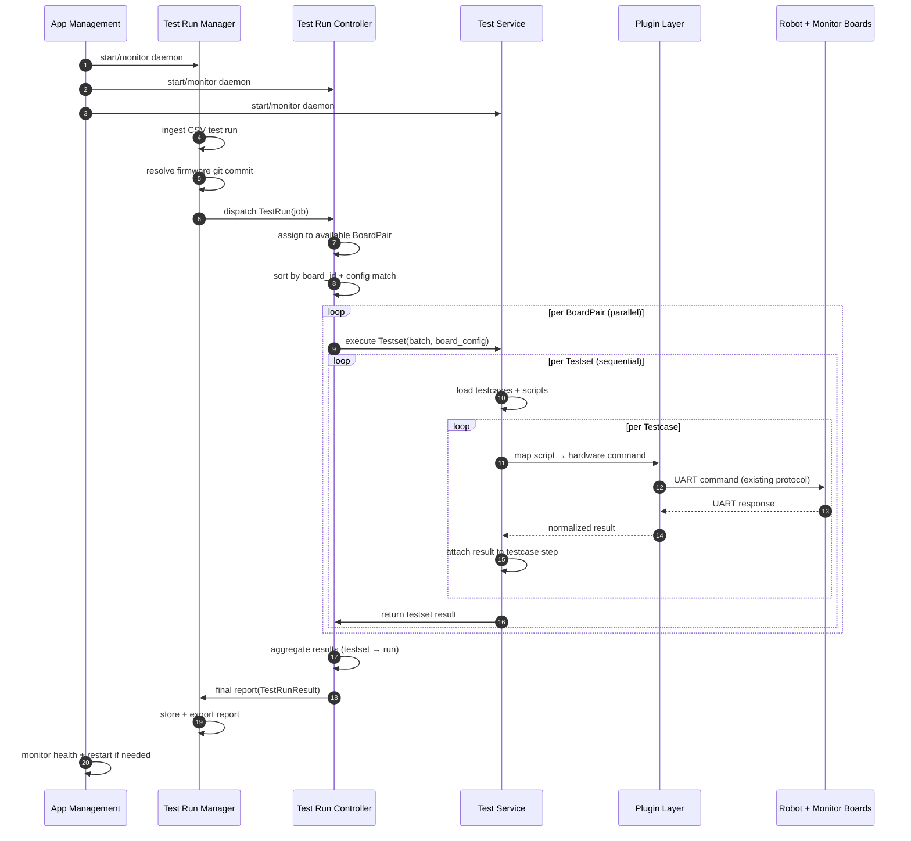
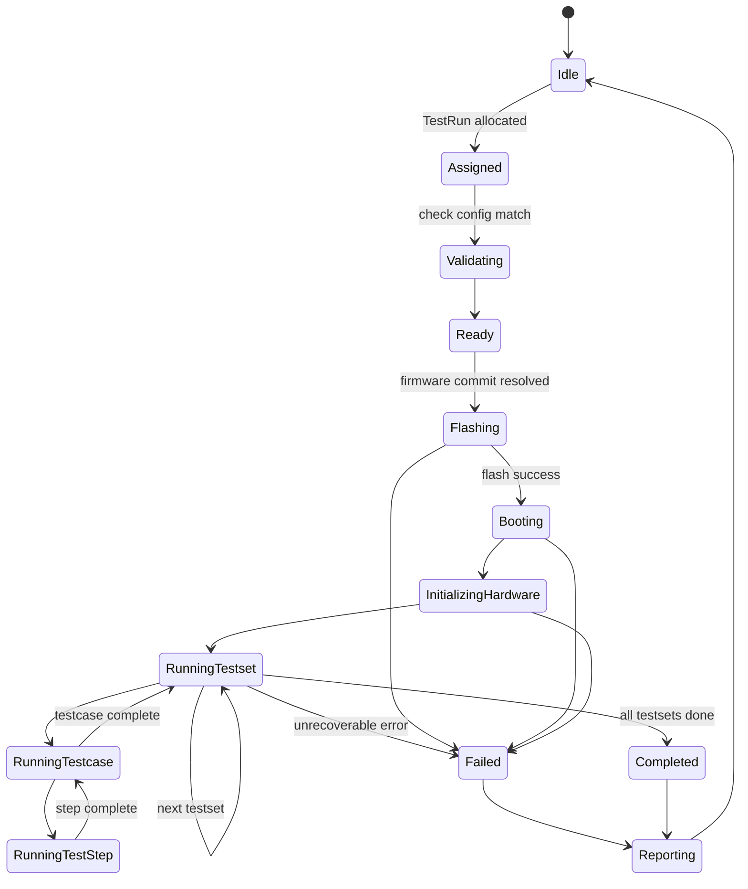

# System Operation Outline

## System Responsibility

- Scheduling logic
* board assignment
* config matching
* sequential testset execution
- Execution state
* where in the test hierarchy you are
* retry rules
* abort conditions
- Orchestration
* calling Test Service
* sequencing commands
* receiving normalized results
* interpreting responses
- Interface through predefined *CAIRS-embedded-software* UART see gscope-app (e.g framing uart and CAN packet)

## Operation Sequence Diagram

This reflects *runtime flow across Manager → Controller → Service → Hardware → back*.



---

## State machine for Test Run Controller

---

## Controller-level states

Each **BoardPair has its own state machine instance**.

### Global Controller States

```text
IDLE
RUNNING
PAUSED
ERROR
SHUTTING_DOWN
```

But more importantly:

---

## Per-BoardPair Execution State Machine



---

## Daemon Running state

| Service             | Model                         |
| ------------------- | ----------------------------- |
| App Management      | ALWAYS RUNNING                |
| Test Run Manager    | ALWAYS RUNNING                |
| Test Run Controller | ALWAYS RUNNING                |
| Test Service        | ALWAYS RUNNING per board-pair |
| Monitoring          | ALWAYS RUNNING                |

---