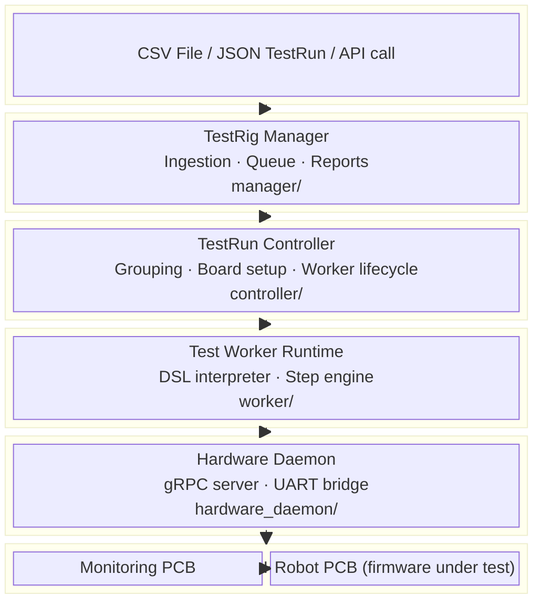
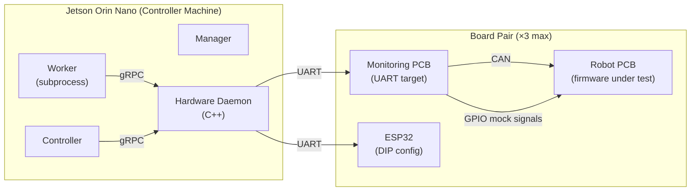
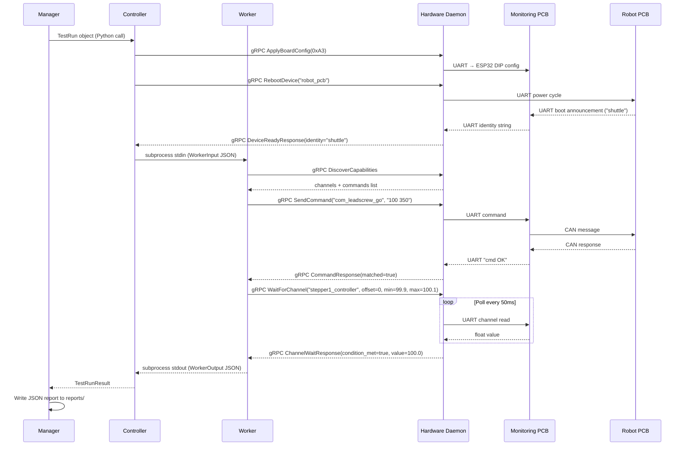
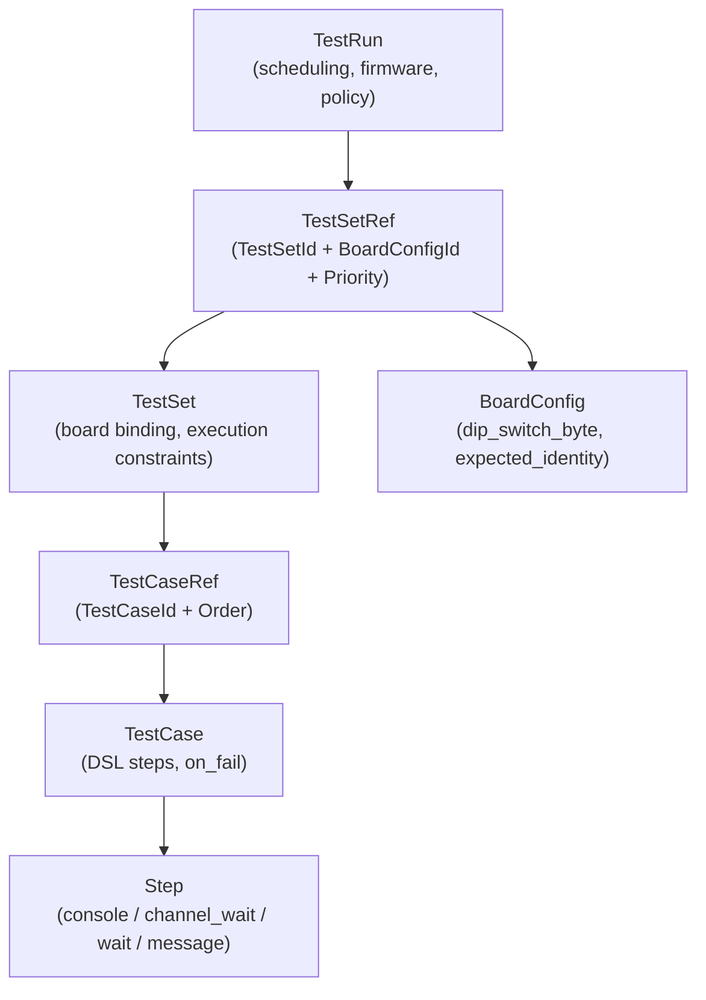
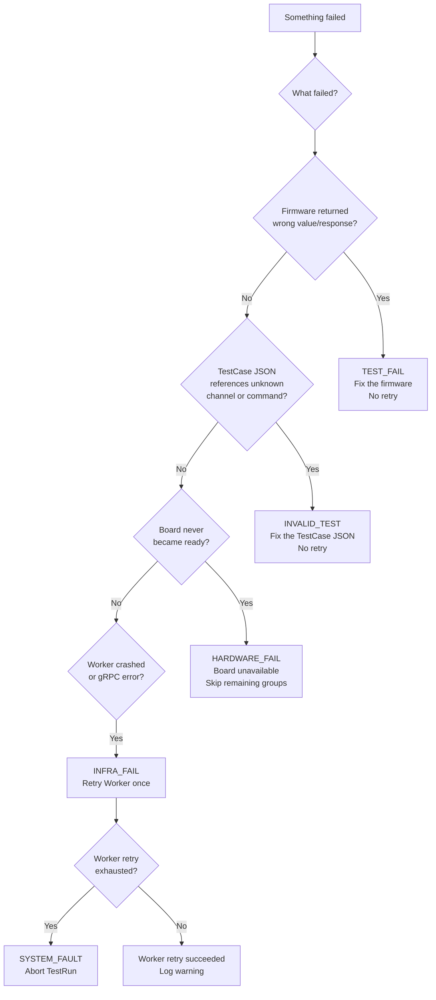

# Architecture

## Contents
- [Design Philosophy](#design-philosophy)
- [Layered Architecture](#layered-architecture)
- [Physical Hardware Model](#physical-hardware-model)
- [Communication Protocols](#communication-protocols)
- [Data Model Hierarchy](#data-model-hierarchy)
- [Failure Classification](#failure-classification)
- [Deployment Model](#deployment-model)

---

## Design Philosophy

The testrig is built around three principles:

**1. Separation of concerns by layer.**
Each layer has a single owner and a single responsibility. The Manager knows about scheduling. The Controller knows about board configuration. The Worker knows about test logic. The Daemon knows about hardware. None of them reach into each other's domain.

**2. Push complexity toward hardware.**
Timing-sensitive operations (UART polling, channel monitoring loops) live in the Hardware Daemon (C++ in production), not in Python. The Worker makes one blocking gRPC call and gets a pass/fail result back.

**3. Test definitions are data, not code.**
Adding a new assembly or a new test requires only new JSON files. No Python code changes are needed unless a genuinely new *type* of hardware interaction is required.

---

## Layered Architecture



### Layer ownership

| Layer | Owner | Runs as | Language |
|---|---|---|---|
| Manager | `manager/` | Long-running process | Python |
| Controller | `controller/` | Called by Manager | Python |
| Worker | `worker/` | Subprocess (spawned per config group) | Python |
| Hardware Daemon | `hardware_daemon/` | Persistent server | Python mock / C++ production |

---

## Physical Hardware Model



**Key hardware facts:**
- The **Robot PCB** runs the firmware under test. It is never addressed directly by the testrig except for optional double-verification.
- The **Monitoring PCB** is the primary UART target. It relays commands to the Robot PCB over CAN and can inject mock signals (e.g. fake encoder pulses) via GPIO.
- The **ESP32** controls the DIP switch array (8 switches via MOSFET array) that configures the Robot PCB hardware mode. Addressed over a separate UART port.
- **Board pairs** are numbered: `pair_1`, `pair_2`, `pair_3`. Currently 1 pair is active.

---

## Communication Protocols



### IPC summary

| From | To | Protocol | Why |
|---|---|---|---|
| Manager | Controller | Python function call | Same process |
| Controller | Worker | subprocess stdin/stdout JSON | Lifecycle isolation, crash boundary |
| Controller | Daemon | gRPC (unary) | Board management |
| Worker | Daemon | gRPC (unary + streaming) | Step execution |
| Monitoring | Daemon | UART | Physical hardware bridge |
| Monitoring | Robot PCB | CAN | Firmware commands |

---

## Data Model Hierarchy



**Ownership:**

| Model | Owner | Lives in |
|---|---|---|
| TestRun | Manager | `definitions/testruns/` |
| TestSet | Controller | `definitions/testsets/` |
| TestCase | Worker | `definitions/testcases/` |
| BoardConfig | Controller | `definitions/configs/` |
| Step | Worker/Daemon | Inline in TestCase JSON |

---

## Failure Classification

Every failure is classified by **why** it happened, not just that it did. This drives retry policy and reporting.



---

## Deployment Model

```
Jetson Orin Nano
├── run_daemon.py          (persistent, start on boot)
├── run_testrun.py         (CLI entry point)
├── manager/               (ingestion + queue)
├── controller/            (orchestration)
├── worker/                (spawned per test group)
├── hardware_daemon/       (gRPC server, C++ in production)
├── definitions/           (test data — JSON + CSV)
│   ├── configs/           (BoardConfig per assembly)
│   ├── testsets/          (grouped test references)
│   ├── testcases/         (DSL step definitions)
│   └── testruns/          (JSON + CSV run specs)
└── reports/               (JSON results, one per run)
```

The daemon is the only component that must always be running. Everything else is invoked on demand.
