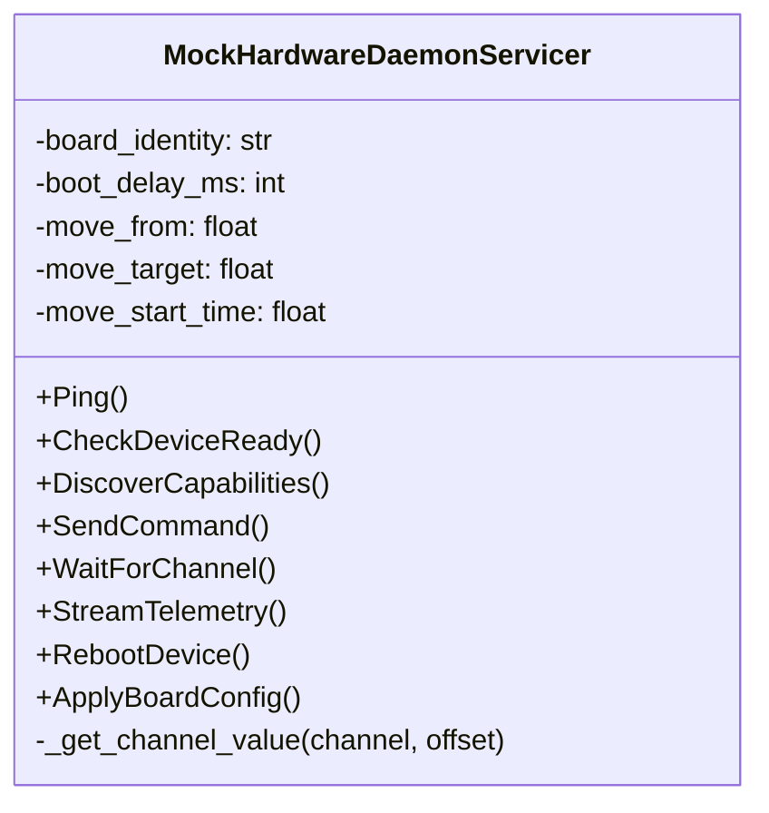
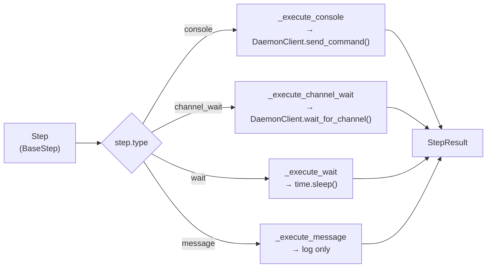
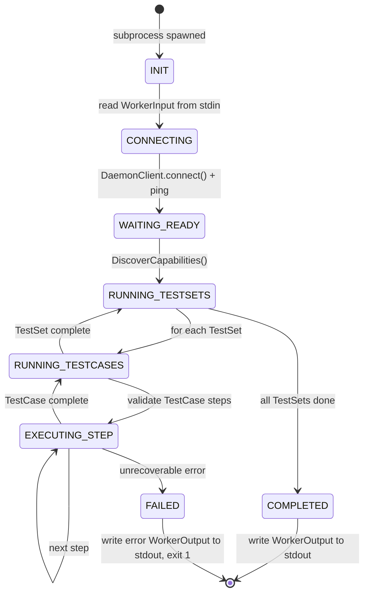
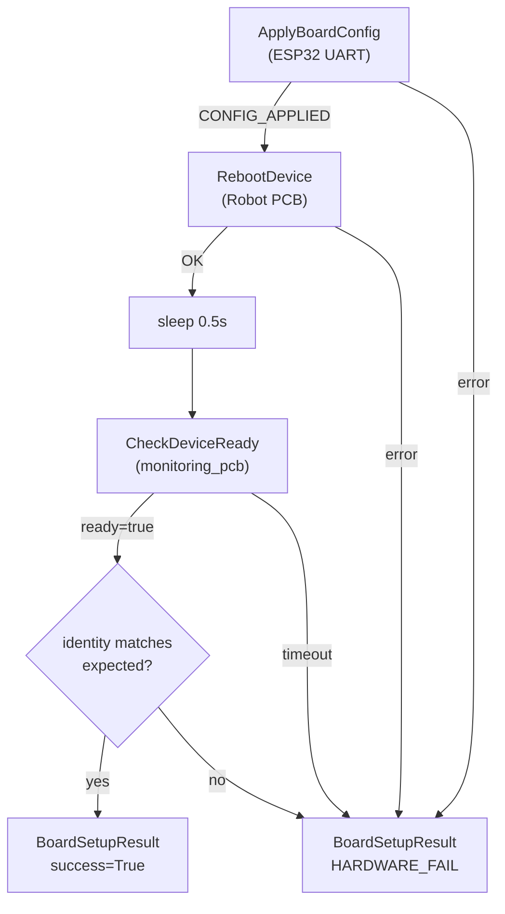

# Components

## Contents
- [Shared Models](#shared-models)
- [Hardware Daemon](#hardware-daemon)
- [Test Worker Runtime](#test-worker-runtime)
- [TestRun Controller](#testrun-controller)
- [TestRig Manager](#testrig-manager)
- [Tools](#tools)
- [Test Suites](#test-suites)
- [Definition Files](#definition-files)

---

## Shared Models

### `shared/enums.py`
Single source of truth for all enumerations. Every component imports from here.

| Enum | Values | Purpose |
|---|---|---|
| `DeviceTarget` | `monitoring_pcb`, `robot_pcb` | Which physical device a step targets |
| `StepType` | `console`, `channel_wait`, `wait`, `message` | DSL step types |
| `FailureType` | `TEST`, `INFRA`, `INVALID_TEST`, `HARDWARE`, `SYSTEM` | Why something failed |
| `StepStatus` | `PASSED`, `FAILED`, `SKIPPED`, `ERROR` | Per-step outcome |
| `TestCaseStatus` | `PASSED`, `FAILED`, `SKIPPED`, `ERROR`, `INVALID` | Per-TestCase outcome |
| `TestSetStatus` | `PASSED`, `FAILED`, `PARTIAL`, `ERROR` | Per-TestSet outcome |
| `TestRunStatus` | `PENDING`, `QUEUED`, `RUNNING`, `COMPLETED`, `FAILED`, `ABORTED` | Top-level run status |
| `ControllerState` | `PENDING`→`COMPLETED` | Controller lifecycle state machine |
| `WorkerState` | `INIT`→`EXIT` | Worker lifecycle state machine |
| `BoardPairState` | `IDLE`, `RUNNING`, `WAITING_CONFIG`, `UNAVAILABLE` | Physical board state |

---

### `shared/models/steps.py`
Pydantic models for each TestCase DSL step type. Uses discriminated union — Pydantic selects the correct model automatically from the `type` field.

| Model | `type` field | Key fields |
|---|---|---|
| `ConsoleStep` | `console` | `command`, `command_param`, `return_string_match`, `timeout_ms` |
| `ChannelWaitStep` | `channel_wait` | `channel_name`, `expected.channel_offset`, `expected.min`, `expected.max`, `timeout_ms` |
| `WaitStep` | `wait` | `timeout_ms` |
| `MessageStep` | `message` | `message` |

All steps inherit `BaseStep`: `step_id`, `type`, `device`, `stop_if_fail`, `description`.

---

### `shared/models/testrig.py`
Core domain models.

| Model | Purpose |
|---|---|
| `BoardConfig` | ESP32 DIP switch config: `dip_switch_byte` (0x00–0xFF), `expected_board_identity` |
| `BoardPair` | Runtime state of one physical board pair |
| `TestCase` | Step list + `on_fail` commands |
| `TestSet` | Ordered list of TestCaseRefs + board binding |
| `TestRun` | Top-level: firmware ref, execution policy, TestSetRefs |
| `TestRunResult` | Aggregated result: all groups → testsets → testcases → steps |
| `DiscoveryResult` | Channels + commands returned by board after reboot |
| `StepResult` | Outcome of one step: status, failure_type, actual_value, error_detail |

---

### `shared/models/worker_io.py`
DTOs exchanged between Controller and Worker via subprocess stdin/stdout.

| Model | Direction | Purpose |
|---|---|---|
| `WorkerInput` | Controller → Worker stdin | Board pair, config, firmware hash, daemon address, resolved TestSets |
| `WorkerOutput` | Worker stdout → Controller | `ConfigGroupResult` with all TestSet/TestCase/Step results |
| `ResolvedTestSet` | Inside WorkerInput | TestSet + fully loaded TestCases (no filesystem access needed in Worker) |

---

### `shared/proto/`

**`hardware_daemon.proto`** — defines the gRPC service contract between Worker/Controller and the Hardware Daemon. This is the boundary between Python and C++.

| RPC | Pattern | Caller | Purpose |
|---|---|---|---|
| `Ping` | Unary | Controller | Liveness check |
| `CheckDeviceReady` | Unary | Controller | Wait for boot + get identity |
| `DiscoverCapabilities` | Unary | Worker | Get channel + command list |
| `SendCommand` | Unary | Worker | Execute GScope command |
| `WaitForChannel` | Unary (blocking) | Worker | Poll channel until condition |
| `StreamTelemetry` | Server-streaming | Monitor tool | Live channel values at 100Hz |
| `RebootDevice` | Unary | Controller | Power cycle Robot PCB |
| `ApplyBoardConfig` | Unary | Controller | Send DIP byte to ESP32 |

**`shared/proto/client.py`** — typed Python wrapper. **Always import from here**, never from `pb2` directly.

---

## Hardware Daemon

### `hardware_daemon/mock_daemon.py`

Python gRPC server that simulates the real C++ Hardware Daemon. Used for all development and CI testing.



**Stateful position simulation:** When `com_leadscrew_go` is received, the daemon stores `move_from`, `move_target`, and `move_start_time`. The channel value function ramps from `move_from` to `move_target` over 5 seconds. This means `WaitForChannel` genuinely waits for the value to move — it doesn't instantly pass.

**Extension tables:**

```python
COMMAND_RESPONSES = {
    "com_enter_service_mode": "cmd OK",
    "com_leadscrew_go":       "cmd OK",
    "on_demand_leadscrew":    "BIST SUCCESS",
    # Add new assembly commands here
}

CHANNEL_REGISTRY = {
    "stepper1_controller": (6, "description", value_fn),
    "stepper1_ic":         (2, "description", value_fn),
    # Add new assembly channels here
}
```

---

## Test Worker Runtime

### `worker/logger.py` — `WorkerLogger`

Structured logger that prefixes every line with context tags:
```
[pair=pair_1 | cfg=SH1 | ts=TS-SHUTTLE-LEADSCREW | tc=TC-SH-LEADSCREW-DRIVE | step=4]
```
Uses context managers (`testset_ctx`, `testcase_ctx`) so the prefix updates automatically as execution progresses.

---

### `worker/step_engine.py` — `StepEngine`

Executes individual DSL steps. Dispatch table maps `StepType` → handler method.



**Failure classification in `_execute_console`:**
- `status == OK, matched == True` → `PASSED`
- `status == OK, matched == False` → `FAILED` / `TEST` (firmware returned wrong response)
- `status == ERROR/TIMEOUT` → `ERROR` / `INFRA` (daemon-level failure)

---

### `worker/worker.py` — entry point

Lifecycle as a subprocess:



**Key functions:**

| Function | Purpose |
|---|---|
| `run_worker(input)` | Main entry point — called by test code and subprocess `__main__` |
| `validate_testcase(tc, discovery, log)` | Pre-execution check: all channels/commands exist on board |
| `execute_testset(ts, tcs, engine, log, policy)` | Loop: TestCase → steps → aggregate result |
| `execute_testcase(tc, engine, log)` | Loop: step → StepResult → aggregate |
| `_aggregate_testcase_status(step_results)` | Roll up step statuses into TestCaseStatus |
| `_aggregate_testset_status(tc_results)` | Roll up TestCase statuses into TestSetStatus |

---

## TestRun Controller

### `controller/loader.py` — `DefinitionLoader`

Scans `definitions/` on first call, builds in-memory index by ID. All lookups are O(1) after initial load.

```
definitions/
  testsets/<any>/<name>.json  → indexed by test_set_id
  testcases/<any>/<name>.json → indexed by test_case_id
  configs/<id>.json           → indexed by board_config_id
```

---

### `controller/grouper.py` — `group_testset_refs()`

Groups `TestSetRef` entries by `board_config_id`. Returns sorted `ConfigGroup` list.

**Batching rule:** All TestSets with the same `board_config_id` share one ESP32 config cycle (one reboot). This is the key optimisation — if you have 5 TestSets for the same board config, the board is rebooted only once.

---

### `controller/board_manager.py` — `BoardManager`

Executes the board setup sequence for one `ConfigGroup`:



---

### `controller/worker_runner.py` — `run_worker_with_retry()`

Spawns Worker subprocess with cross-platform PYTHONPATH handling. Uses `os.pathsep` (`;` on Windows, `:` on Linux) and `sys.executable` (the current venv Python).

**Retry logic:**
```
attempt 1 → success? return result
         → failure → attempt 2
attempt 2 → success? return result (log warning, set worker_retries=1)
         → failure → return SYSTEM fault
```

---

### `controller/controller.py` — `TestRunController`

Main orchestrator. Connects to daemon once and reuses the connection across all groups.

---

## TestRig Manager

### `manager/ingestor.py`

Two entry points:

**`ingest_json(path)`** — loads and validates a `TestRun` JSON file directly.

**`ingest_csv(csv_input)`** — parses CSV into a `TestRun`:

| CSV Column | Required | Notes |
|---|---|---|
| `FirmwareHash` | ✓ | All rows must match |
| `TestSetId` | ✓ | Must exist in definitions/ |
| `BoardConfigId` | ✓ | Must exist in definitions/ |
| `Priority` | optional | Default 1 |
| `RequestedBy` | optional | Written to report metadata |

---

### `manager/queue.py` — `TestRunQueue`

Thread-safe priority queue. Sort key: `(priority, sequence)` — lower priority number first, FIFO tiebreaker.

---

### `manager/reporter.py` — `Reporter`

Writes `TestRunResult` to JSON using atomic write (temp file → rename). Filename: `<run_id>_<timestamp>_<status>.json`.

---

### `manager/manager.py` — `TestRigManager`

Public API:

| Method | Input | Use case |
|---|---|---|
| `run_json(path)` | JSON file | Predefined regression suite |
| `run_csv(csv)` | CSV string or file | Ad-hoc run |
| `enqueue_json(path)` | JSON file | Queue for later |
| `enqueue_csv(csv)` | CSV | Queue for later |
| `run_queue()` | — | Process all queued runs |
| `queue_status()` | — | Monitoring |

---

## Tools

### `tools/grpc_monitor.py`

CLI tool to inspect the Hardware Daemon directly.

| Subcommand | What it does |
|---|---|
| `ping` | Confirm daemon is alive |
| `discover` | List all channels and commands on a device |
| `stream <channel>` | Live telemetry at 100Hz (server-streaming RPC) |
| `send <cmd> [param]` | Send a GScope command |
| `watch <channel> <offset> <min> <max>` | Block until channel value enters range |
| `ready` | Check device readiness and board identity |

---

### `tools/process_monitor.py`

Live process monitor (refreshes every 2s). Shows daemon status, all testrig PIDs, CPU%, memory, port state. Requires `psutil`.

---

## Test Suites

| File | Phase | Tests | What it covers |
|---|---|---|---|
| `tests/test_mock_daemon.py` | 3 | 16 | Every gRPC RPC method |
| `tests/test_worker.py` | 4 | 18 | Step engine, validation, result aggregation |
| `tests/test_controller.py` | 5 | 17 | Grouping, board setup, subprocess, retry |
| `tests/test_manager.py` | 6 | 32 | Ingestion, validation, queue, reporter, full flow |
| `tests/test_end_to_end.py` | E2E | 37 | Full pipeline, both direct and Manager paths |

All test files are **self-contained** — each starts its own mock daemon on a private port.

---

## Definition Files

### BoardConfig (`definitions/configs/SH1.json`)
```json
{
  "board_config_id": "SH1",
  "dip_switch_byte": 163,
  "expected_board_identity": "shuttle",
  "esp32_uart_port": null
}
```
`dip_switch_byte` is a single byte (e.g. `163` = `0xA3` = `0b10100011`). Each bit maps to one DIP switch (bit 0 = SW1).

### TestSet (`definitions/testsets/shuttle/leadscrew.json`)
Binds TestCases to a board type. `stop_on_failure: false` means all TestCases run even if one fails.

### TestCase (`definitions/testcases/shuttle/leadscrew_drive.json`)
Contains the step list. Steps execute sequentially. `stop_if_fail: true` on a step skips remaining steps in that TestCase if it fails.

### TestRun JSON (`definitions/testruns/TR-2026-05-00001.json`)
Top-level scheduling document. References TestSets by ID with a `BoardConfigId` and priority.

### TestRun CSV (`definitions/testruns/shuttle_regression.csv`)
Lightweight format. One row per TestSet.
