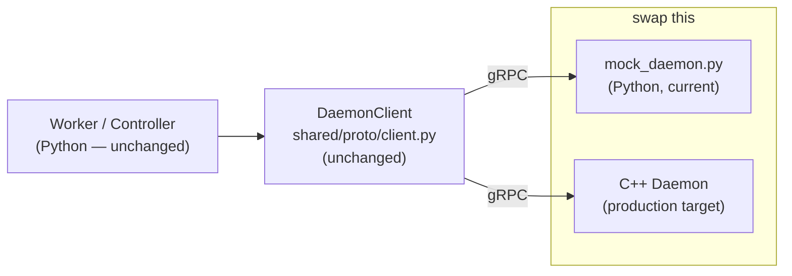
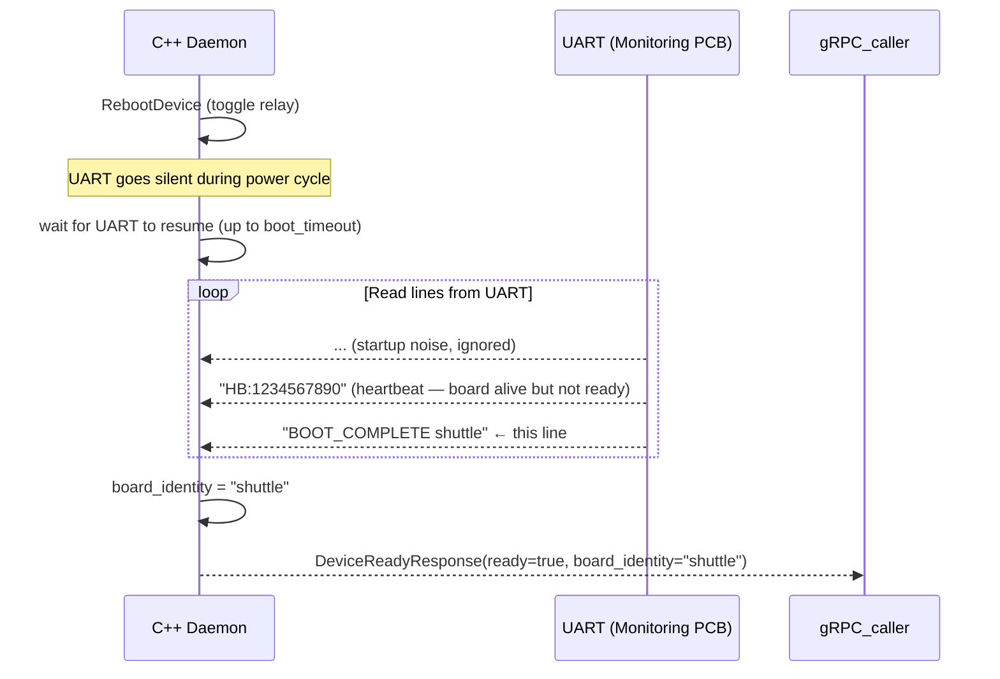

# Replacing the Mock with Real Hardware

## Contents
- [Overview](#overview)
- [What the Mock Does](#what-the-mock-does)
- [Hardware Daemon Interface Contract](#hardware-daemon-interface-contract)
- [Implementation Checklist](#implementation-checklist)
- [UART Protocol Design](#uart-protocol-design)
- [ESP32 Config Protocol](#esp32-config-protocol)
- [Board Readiness Protocol](#board-readiness-protocol)
- [Channel Discovery Protocol](#channel-discovery-protocol)
- [Running Side-by-Side](#running-side-by-side)
- [Monitoring PCB Firmware Notes](#monitoring-pcb-firmware-notes)

---

## Overview

The system is designed so that **no Python code changes are required** when replacing the mock daemon with the real C++ daemon. The gRPC contract defined in `shared/proto/hardware_daemon.proto` is the boundary — the Worker and Controller only ever call `DaemonClient` methods. They do not know or care whether the server is Python or C++.



---

## What the Mock Does

Understanding what the mock simulates helps you implement the real version correctly.

| Mock behaviour | Real implementation needed |
|---|---|
| `CheckDeviceReady`: sleeps `boot_delay_ms`, returns `board_identity` from constructor arg | Read UART until Robot PCB announces its identity string |
| `DiscoverCapabilities`: returns hardcoded channel/command list | Send UART discovery handshake to Monitoring PCB, parse response |
| `SendCommand`: looks up response in `COMMAND_RESPONSES` dict | Send command string over UART, read response until newline or timeout |
| `WaitForChannel`: ramps a float value toward target over 5 seconds | Poll GScope UART channel, compare value at offset to [min, max] |
| `StreamTelemetry`: emits synthetic values at 100Hz | Read GScope UART channel continuously, stream parsed values |
| `RebootDevice`: sleeps briefly, resets internal position state | Toggle power relay or reset GPIO, wait for UART silence |
| `ApplyBoardConfig`: returns `CONFIG_APPLIED` immediately | Send config byte to ESP32 over UART, wait for `CONFIG_APPLIED` response |

---

## Hardware Daemon Interface Contract

The C++ daemon must implement this gRPC service exactly. The proto file is the specification.

```
shared/proto/hardware_daemon.proto
```

Key constraints the C++ implementation must respect:

**`SendCommand`**
- `status = DEVICE_STATUS_OK` when command was sent and a response was received, even if `matched = false`
- `status = DEVICE_STATUS_ERROR` only for UART-level failures (timeout, disconnect, malformed response)
- `matched = (return_string_match found in response)` — substring check, not exact match
- Never set `status = ERROR` just because the match failed — that is `TEST_FAIL`, not `INFRA_FAIL`

**`WaitForChannel`**
- Poll UART internally at ≥10Hz (50ms interval is fine)
- `condition_met = true` if value[offset] entered [min_value, max_value] before timeout
- `status = DEVICE_STATUS_TIMEOUT` if timeout expires
- `last_value` = the most recently read value regardless of whether condition was met

**`CheckDeviceReady`**
- Block until boot announcement received on UART or `timeout_ms` expires
- `board_identity` = the exact string the board announced (e.g. `"shuttle"`)
- `ready = false` + `status = TIMEOUT` if no announcement within timeout

**`StreamTelemetry`**
- Server-streaming RPC — keep sending `TelemetryFrame` messages until client cancels
- `timestamp_ms` = monotonic milliseconds since daemon started
- `values` = all `num_fields` float values for that channel sample

---

## Implementation Checklist

### Phase 1 — UART layer

```
□ Open UART port to Monitoring PCB (from config)
□ Open UART port to ESP32 (from config, separate port)
□ Implement reconnect after Robot PCB reboot (UART goes silent during reboot)
□ Thread-safe UART read/write (daemon handles concurrent gRPC calls)
□ Line-based read (newline-terminated responses)
□ Timeout handling on every read
```

### Phase 2 — gRPC server

```
□ Implement all 8 RPC methods from hardware_daemon.proto
□ Port 50051 by default (configurable)
□ ThreadPoolExecutor with sufficient threads (4 minimum)
□ Graceful shutdown on SIGTERM
```

### Phase 3 — Per-RPC implementation

```
□ Ping          — return alive=true, version string
□ CheckDeviceReady   — read UART until identity string or timeout
□ DiscoverCapabilities — send handshake, parse channel/command list
□ SendCommand        — send + read response, classify status correctly
□ WaitForChannel     — polling loop, condition check, timeout
□ StreamTelemetry    — continuous channel read, emit frames
□ RebootDevice       — toggle relay/GPIO, handle UART reconnect
□ ApplyBoardConfig   — send byte to ESP32, wait for ACK
```

### Phase 4 — Verification

```
□ Run python -m tools.grpc_monitor ping  (against real C++ daemon)
□ Run python -m tools.grpc_monitor discover
□ Run python -m tools.grpc_monitor stream stepper1_controller
□ Run python -m tests.test_mock_daemon  (swap port to real daemon port)
□ Run python -m tests.test_end_to_end   (with real daemon)
□ Run python run_testrun.py --csv-file definitions/testruns/shuttle_regression.csv
```

---

## UART Protocol Design

The Monitoring PCB firmware (not yet built) will speak a UART protocol that the daemon understands. Suggested design — keep it line-based for debuggability:

### Commands (daemon → monitoring PCB)
```
com_leadscrew_go 100 350\n
on_demand_leadscrew\n
com_enter_service_mode\n
```

### Responses (monitoring PCB → daemon)
```
cmd OK\n
BIST SUCCESS\n
BIST FAIL\n
```

### Channel data (monitoring PCB → daemon, periodic)
```
CHAN stepper1_controller 0 100.023 1.234 0.500 100.000 2.000 100.021\n
CHAN stepper1_ic 0 0 0\n
```
Format: `CHAN <name> <offset_start> <value0> <value1> ... <valueN>\n`

### Boot announcement
```
BOOT_COMPLETE shuttle\n
```
Format: `BOOT_COMPLETE <identity>\n`

### Discovery handshake
Daemon sends:
```
DISCOVER\n
```
Monitoring PCB responds:
```
CHANNEL stepper1_controller 6 Shuttle leadscrew stepper\n
CHANNEL stepper1_ic 2 IC driver registers\n
COMMAND com_leadscrew_go 1\n
COMMAND on_demand_leadscrew 0\n
COMMAND com_enter_service_mode 0\n
COMMAND com_change_mode 1\n
DISCOVER_END\n
```
Format for CHANNEL: `CHANNEL <name> <num_fields> <description>\n`
Format for COMMAND: `COMMAND <name> <has_params_0_or_1>\n`

> These are suggestions. You own the Monitoring PCB firmware, so adapt as needed. The daemon is the only component that speaks UART — nothing else needs to change.

---

## ESP32 Config Protocol

The ESP32 controls the DIP switch MOSFET array. Suggested UART protocol:

Daemon sends (one byte as hex string):
```
CONFIG A3\n
```

ESP32 responds:
```
CONFIG_APPLIED\n
```

Or on error:
```
CONFIG_ERROR invalid_byte\n
```

The daemon maps `BoardConfig.dip_switch_byte` (e.g. `163`) → `"CONFIG A3\n"`.

---

## Board Readiness Protocol

After `RebootDevice`, the daemon must wait for the Robot PCB to boot and announce itself.



The current spec requires **at least 2 mechanisms** before declaring ready:
1. Boot string received (`BOOT_COMPLETE <identity>`)
2. Heartbeat stable for N cycles (`HB:<timestamp>`)

For the initial implementation, boot string alone is sufficient.

---

## Running Side-by-Side

During C++ daemon development, you can run mock and real daemons on different ports:

**Terminal 1 — mock on 50051 (for tests):**
```bash
python run_daemon.py --port 50051
```

**Terminal 2 — real C++ daemon on 50052:**
```bash
./hardware_daemon --port 50052
```

**Test against real daemon:**
```bash
python run_testrun.py definitions/testruns/shuttle_regression.csv --daemon localhost:50052
```

**gRPC monitor against real daemon:**
```bash
python -m tools.grpc_monitor --daemon localhost:50052 discover
python -m tools.grpc_monitor --daemon localhost:50052 stream stepper1_controller
```

---

## Monitoring PCB Firmware Notes

The Monitoring PCB firmware is the bridge between the testrig and the Robot PCB. Key responsibilities:

1. **UART command reception** — receive command strings from daemon, parse, relay to Robot PCB via CAN
2. **CAN message dispatch** — map command strings to CAN message structs (see `messages-list.hpp`)
3. **GScope channel streaming** — read Robot PCB GScope channels over CAN, stream as `CHAN` lines
4. **Mock signal injection** — GPIO outputs that connect to Robot PCB inputs (encoder, limit switch)
5. **Boot announcement** — emit `BOOT_COMPLETE <identity>\n` after initialisation
6. **Heartbeat** — emit `HB:<timestamp>\n` periodically
7. **Discovery response** — respond to `DISCOVER\n` with channel and command list

You can reuse the HAL and lower-level drivers from the Robot PCB firmware. The application layer is new.

**CAN message mapping example** (from `messages-list.hpp`):

| UART command received | CAN message sent |
|---|---|
| `com_leadscrew_go 100 350` | `ShuttleLeadscrewMsg::Cmd{translation_mm=100, velocity_mmps=350}` |
| `com_enter_service_mode` | `OperationModeMsg::Cmd{target_mode=SERVICE}` |
| `on_demand_leadscrew` | `OnDemandBISTMsg::Cmd{assembly_id=SHUTTLE_LEADSCREW}` |
| `com_change_mode 2` | `OperationModeMsg::Cmd{target_mode=NORMAL}` |
