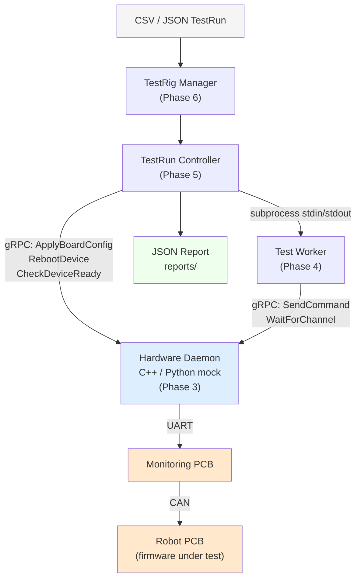

# TestRig Documentation

> Automated PCB firmware testing system for the Machnet Medical Robotics robot platform.

---

## Contents

| Document | Description |
|---|---|
| [Architecture](architecture.md) | System design, layered components, communication protocols |
| [Components](components.md) | Detailed specification of every module, class, and file |
| [System Operation & Sequences](sequences.md) | How data flows end-to-end, state machines, sequence diagrams |
| [Adding New Functions](extending.md) | How to add assemblies, step types, commands, and devices |
| [Replacing the Mock](hardware_integration.md) | Guide to swapping the mock daemon for real hardware |
| [Usage Guide](usage.md) | Setup, running tests, CLI reference, CSV format |
| [Testing & Verification](testing.md) | Test suite overview, what each test validates, CI guidance |

---

## Quick Start

```bash
# 1. One-time setup
python setup_dev.py

# 2. Activate venv
# Windows:  .venv\Scripts\Activate.ps1
# Linux:    source .venv/bin/activate

# 3. Start mock daemon (Terminal 1)
python run_daemon.py

# 4. Run full test suite (Terminal 2)
python -m tests.test_end_to_end

# 5. Run a TestRun from CSV
python run_testrun.py --csv-file definitions/testruns/shuttle_regression.csv --manager
```

---

## System in One Diagram



---

## Deployment Target

| Environment | Platform | Python | Daemon |
|---|---|---|---|
| Development | Windows 10/11 | 3.11+ | Python mock |
| Deployed | Jetson Orin Nano (Linux) | 3.11+ | C++ (future) |

Both use identical Python code. The only future difference is `esp32_uart_port` in `BoardConfig` (`COM4` vs `/dev/ttyUSB1`).
