# System Operation & Sequences

## Contents
- [End-to-End Flow](#end-to-end-flow)
- [Manager Ingestion](#manager-ingestion)
- [Controller State Machine](#controller-state-machine)
- [Board Setup Sequence](#board-setup-sequence)
- [Worker Lifecycle](#worker-lifecycle)
- [Step Execution](#step-execution)
- [Failure Paths](#failure-paths)
- [Channel Discovery](#channel-discovery)

---

## End-to-End Flow

This is the complete path from user input to report file.

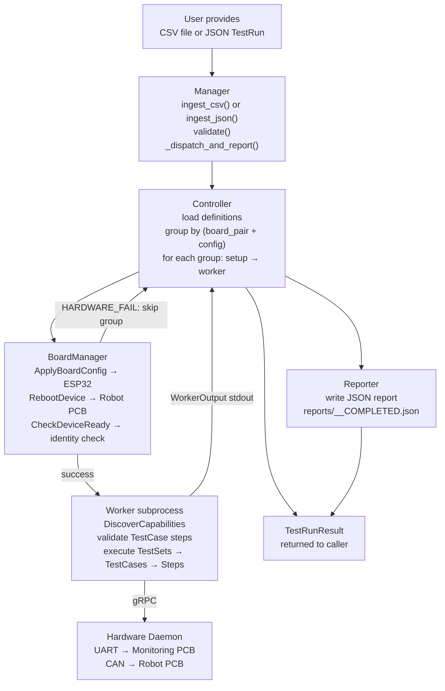

---

## Manager Ingestion

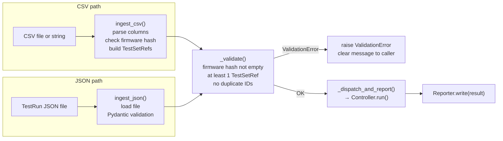

**CSV column rules:**
- All rows must share the same `FirmwareHash` — one firmware per TestRun
- `Priority` defaults to 1 if omitted
- `RequestedBy` is optional — used in report metadata
- Multiple rows with the same `BoardConfigId` are batched by the Controller (one reboot)

---

## Controller State Machine

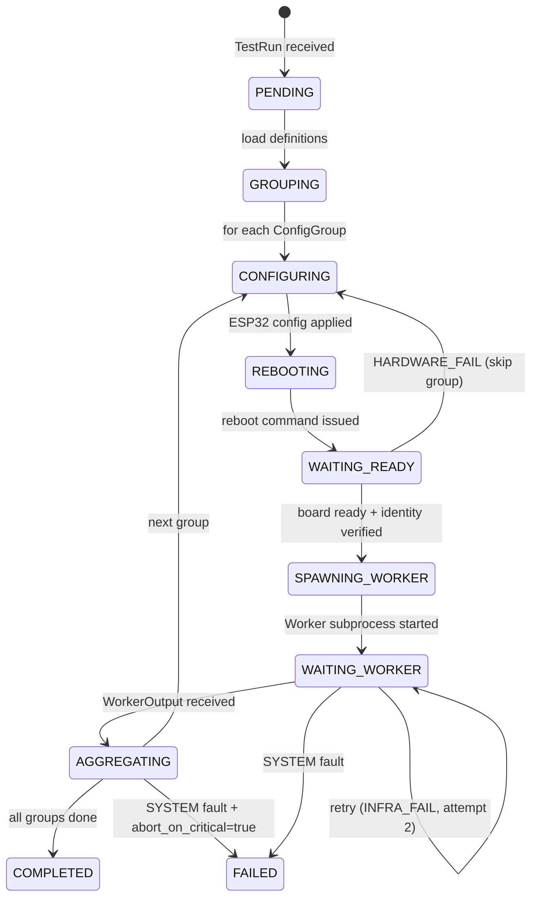

---

## Board Setup Sequence

This sequence runs once per `ConfigGroup` before a Worker is spawned.

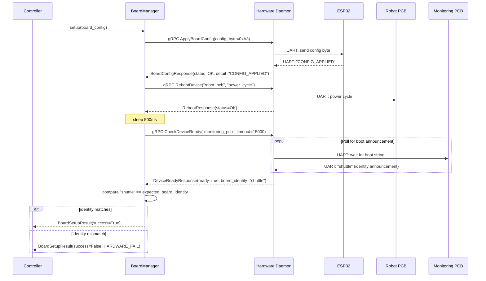

---

## Worker Lifecycle

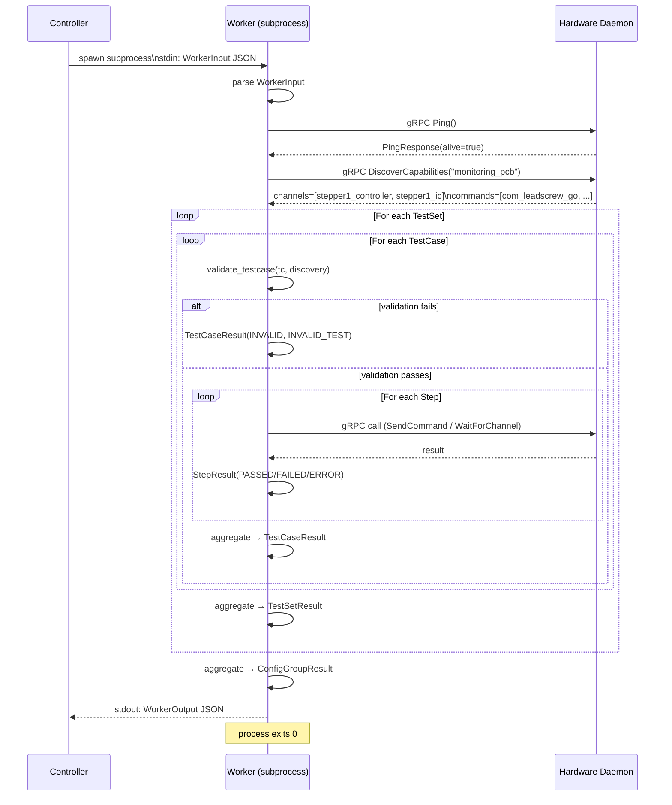

---

## Step Execution

### CONSOLE step

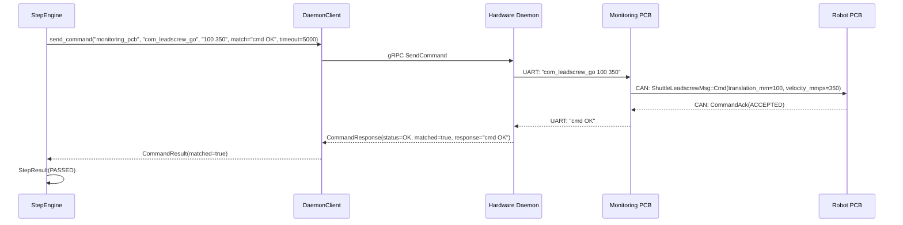

### CHANNEL_WAIT step

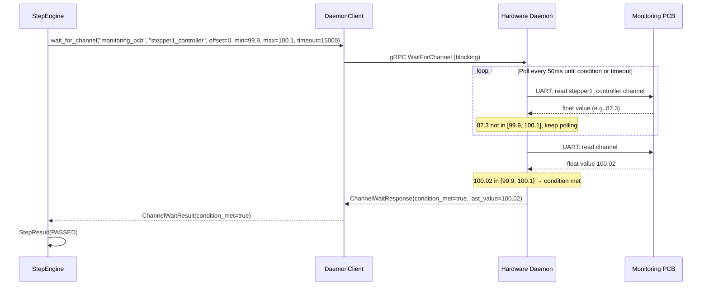

---

## Failure Paths

### TEST_FAIL — firmware returned wrong response

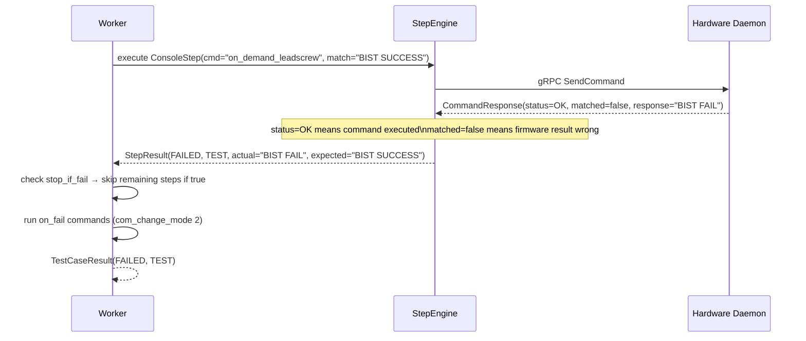

### INFRA_FAIL + retry

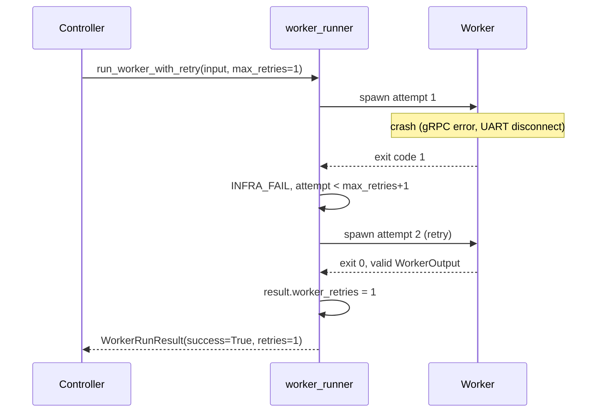

### HARDWARE_FAIL — board identity mismatch

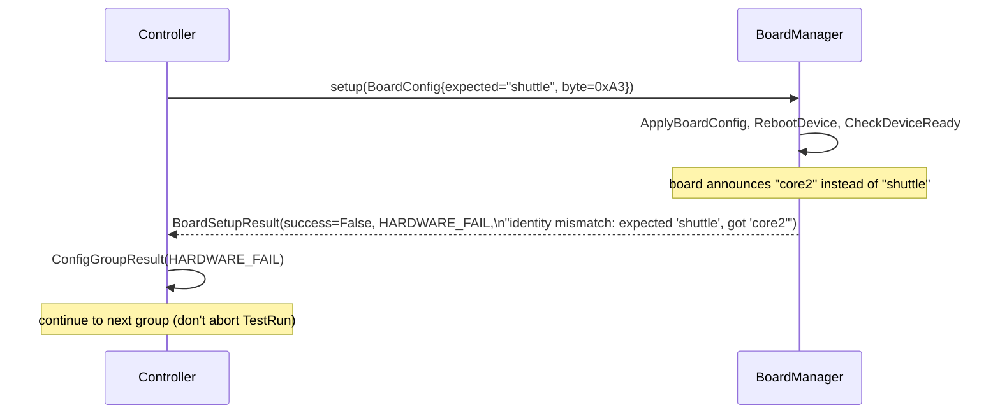

---

## Channel Discovery

The first thing the Worker does after connecting to the daemon is discover what channels and commands the board exposes. This prevents invalid TestCase steps from executing against the wrong firmware.

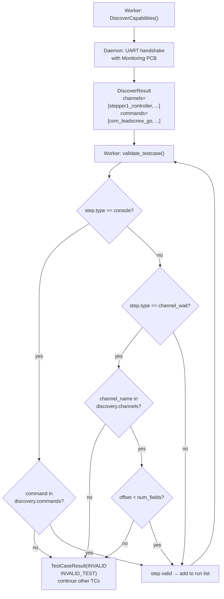

**Note on current mock behaviour:** The mock daemon returns a hardcoded `DiscoverResult` matching the shuttle assembly. When the real C++ daemon is implemented, this will be replaced by an actual UART handshake with the Monitoring PCB.
