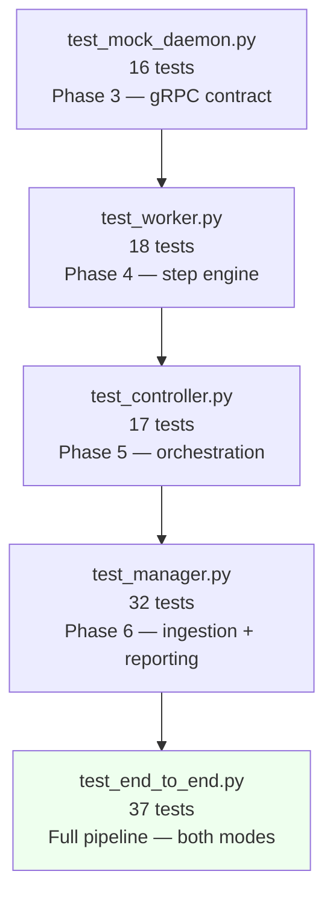
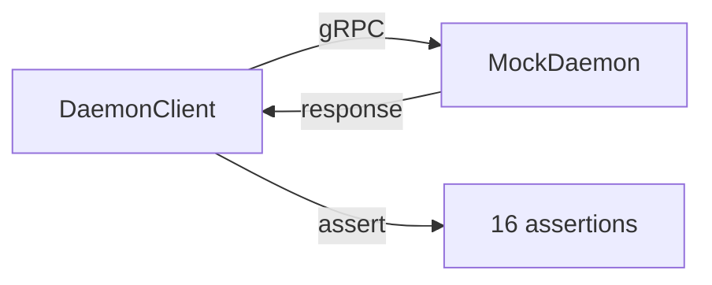
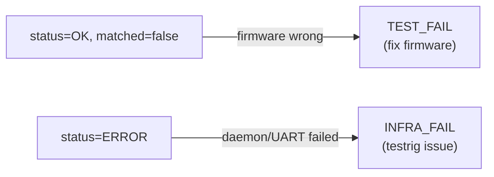

# Testing & Verification Guide

## Contents
- [Test Suite Overview](#test-suite-overview)
- [Running Tests](#running-tests)
- [What Each Test Validates](#what-each-test-validates)
- [Test Scenarios Reference](#test-scenarios-reference)
- [Writing New Tests](#writing-new-tests)
- [CI Integration](#ci-integration)
- [Full System Verification Checklist](#full-system-verification-checklist)

---

## Test Suite Overview



**Total: 120 tests across 5 suites.**

All test files are **self-contained** — each starts its own mock daemon on a private port. You never need to run `run_daemon.py` before running tests.

---

## Running Tests

```bash
# Activate venv first:
# Windows: .venv\Scripts\Activate.ps1
# Linux:   source .venv/bin/activate

# Run individual suites:
python -m tests.test_mock_daemon
python -m tests.test_worker
python -m tests.test_controller
python -m tests.test_manager
python -m tests.test_end_to_end

# Run all:
python -m tests.test_mock_daemon && \
python -m tests.test_worker && \
python -m tests.test_controller && \
python -m tests.test_manager && \
python -m tests.test_end_to_end

# End-to-end — without Manager (Mode A only):
python -m tests.test_end_to_end --no-manager

# End-to-end — Manager only (Mode B only):
python -m tests.test_end_to_end --manager-only
```

---

## What Each Test Validates

### `test_mock_daemon.py` — Phase 3

Validates the gRPC contract between client and server. Every RPC method is called and the response is checked.



| Test | What it checks |
|---|---|
| Ping | `alive=True`, version string present |
| CheckDeviceReady (monitoring_pcb) | `ready=True`, `board_identity="shuttle"` |
| CheckDeviceReady (robot_pcb) | `ready=True` |
| DiscoverCapabilities — channels | `stepper1_controller`, `stepper1_ic` present |
| DiscoverCapabilities — commands | All 4 shuttle commands present |
| Channel num_fields | `stepper1_controller` has exactly 6 fields |
| SendCommand — enter service mode | `matched=True`, response `"cmd OK"` |
| SendCommand — BIST | `matched=True`, response `"BIST SUCCESS"` |
| SendCommand — leadscrew go | `matched=True` |
| SendCommand — unknown command | `status=ERROR`, `matched=False` |
| WaitForChannel — converge to setpoint | `condition_met=True`, value in [99.0, 101.0] |
| WaitForChannel — after reboot | Value near 0 after reboot |
| WaitForChannel — unknown channel | `status=ERROR` |
| StreamTelemetry — 5 frames | Each frame has 6 values |
| ApplyBoardConfig | `status=OK`, `detail="CONFIG_APPLIED"` |
| RebootDevice | `status=OK` |

---

### `test_worker.py` — Phase 4

Tests the Worker's step engine, validation logic, and result aggregation. Uses a live mock daemon started per test.

| # | Scenario | Key assertion |
|---|---|---|
| 1 | Happy path — full leadscrew flow | TestSet `PASSED`, all 6 steps `PASSED` |
| 2 | Step `TEST_FAIL` — continues to next TC | First TC `FAILED/TEST`, second TC still runs |
| 3 | `stop_if_fail=true` — skips remaining steps | Steps 2,3 `SKIPPED` after step 1 fails |
| 4 | Unknown channel → `INVALID_TEST` | TC `INVALID`, other TCs still run |
| 5 | Channel offset out of range → `INVALID_TEST` | TC `INVALID` |
| 6 | `stop_on_channel_validation_error=True` | Group aborts after first invalid TC |
| 7 | TestSet `stop_on_failure=True` | Second TC skipped after first fails |
| 8 | `on_fail` commands run on TC failure | No crash, on_fail executes |
| 9 | Daemon `ERROR` response → `INFRA_FAIL` | Step `ERROR/INFRA`, not `FAILED/TEST` |
| 10 | Subprocess stdin/stdout contract | `WorkerOutput` JSON parseable |

**Critical distinction tested (test 9):**



---

### `test_controller.py` — Phase 5

Tests the Controller's orchestration logic. Spawns real Worker subprocesses against a live mock daemon.

| # | Scenario | Key assertion |
|---|---|---|
| 1 | DefinitionLoader — loads all files | All 3 TCs and 2 TestSets indexed |
| 2 | Grouper — priority ordering | SH1 group: TS-B (priority 1) before TS-A (priority 2) |
| 3 | Happy path — full TestRun | `COMPLETED`, 1 group, TestSet `PASSED` |
| 4 | Board identity mismatch | `HARDWARE_FAIL`, detail mentions "identity mismatch" |
| 5 | Missing BoardConfig definition | `INFRA_FAIL` on that group |
| 6 | Missing TestSet definition | `INFRA_FAIL` on that group |
| 7 | Daemon unreachable → abort | `TestRunStatus.ABORTED` |
| 8 | Worker retry succeeds | `worker_retries=1` in result, group `PASSED` |

---

### `test_manager.py` — Phase 6

Tests ingestion, validation, queue, reporter, and full Manager flow.

| # | Scenario | Key assertion |
|---|---|---|
| 1 | `ingest_json` — valid file | Correct ID, 1 ref, correct hash |
| 2 | `ingest_json` — file not found | `IngestionError` raised |
| 3 | `ingest_json` — malformed JSON | `IngestionError` raised |
| 4 | `ingest_csv` — valid string | 2 refs, correct hash, priority, requested_by |
| 5 | `ingest_csv` — missing column | `IngestionError` |
| 6 | `ingest_csv` — inconsistent hash | `IngestionError` |
| 7 | `ingest_csv` — from file path | 1 ref loaded |
| 8 | Validate — empty TestSetRefs | `ValidationError` |
| 9 | Validate — duplicate TestSetRef IDs | `ValidationError` |
| 10 | Queue priority ordering | TR-2 (priority 1) dequeued before TR-1 (priority 2) |
| 11 | Reporter — write and load | File exists, ID in filename, round-trip parse |
| 12 | `Manager.run_json` — full flow | `COMPLETED`, group passes, report written |
| 13 | `Manager.run_csv` — full flow | `COMPLETED`, firmware hash propagated |
| 14 | `run_queue` — priority order | High priority run executed first |

---

### `test_end_to_end.py` — Full Pipeline

Two modes covering the complete system.

**Mode A — Direct Controller (no Manager):**

| Test | Flow |
|---|---|
| A1 — Full flow | JSON → TestRunController.run() → assert all 6 steps pass |
| A2 — Serialisation | Result round-trips to JSON and back |

**Mode B — With Manager:**

| Test | Flow |
|---|---|
| B1 — JSON file | JSON → Manager.run_json() → result + report file |
| B2 — CSV string | CSV → Manager.run_csv() → result + report file |

**End-to-end assertions (both modes):**
- TestRun `status = COMPLETED`
- No `system_fault_detail`
- Firmware hash = `a1b2c3d4`
- 1 ConfigGroup (SH1)
- ConfigGroup has no failure_type
- TestSet = `TS-SHUTTLE-LEADSCREW`, status = `PASSED` (Mode A/B1/B2 — single TC run)
- Or `PARTIAL` (when all 3 TCs run — TC-OVERTRAVEL intentionally fails)
- TestCase = `TC-SH-LEADSCREW-DRIVE`, status = `PASSED`
- 6 step results, all `PASSED`

---

## Test Scenarios Reference

### Shuttle Leadscrew TestCases

| TestCase | Steps | Expected result | What it tests |
|---|---|---|---|
| `TC-SH-LEADSCREW-DRIVE` | 6 | `PASSED` | Full drive: BIST → 100mm → 0mm |
| `TC-SH-LEADSCREW-ENCODER-TRACK` | 7 | `PASSED` | Motor position == encoder position at 50mm |
| `TC-SH-LEADSCREW-OVERTRAVEL` | 6 | `FAILED` (step 4) | Intentional: checks impossible range [150, 200] |

**Overtravel test step breakdown:**

| Step | Type | Expected |
|---|---|---|
| 1 | console | PASSED — enter service mode |
| 2 | console | PASSED — move to 100mm |
| 3 | channel_wait | PASSED — confirm at 100mm |
| 4 | channel_wait [150,200] | **FAILED** — 100mm never reaches 150mm |
| 5 | console | PASSED — return home (stop_if_fail=false) |
| 6 | channel_wait | PASSED — confirm at home |

---

## Writing New Tests

### Test file structure

```python
"""
tests/test_my_feature.py
Brief description of what this test covers.

Run with:
    python -m tests.test_my_feature
"""
import sys, time, logging
from hardware_daemon.mock_daemon import serve

logging.basicConfig(level=logging.WARNING, stream=sys.stderr, ...)

PORT = 50093   # pick a unique port not used by other test files
passed = 0
failed = 0

def ok(label): ...
def fail(label, detail=""): ...

def test_something():
    print("\n[1] description")
    # ... test logic ...
    ok("assertion label")

def main():
    server = serve(port=PORT, board_identity="shuttle", boot_delay_ms=100)
    time.sleep(0.2)   # let server bind
    try:
        test_something()
    finally:
        server.stop(grace=0)
    
    total = passed + failed
    print(f"\n  Tests: {passed}/{total} passed")
    if failed: sys.exit(1)

if __name__ == "__main__":
    main()
```

### Port assignments (avoid conflicts)

| Test file | Port |
|---|---|
| `test_mock_daemon.py` | 50099 |
| `test_worker.py` | 50098 |
| `test_controller.py` | 50097 |
| `test_manager.py` | 50094 |
| `test_end_to_end.py` | 50095 |
| New tests | 50090 and below |

---

## CI Integration

The test suite is self-contained and runs without any external services.

### GitHub Actions example

```yaml
name: TestRig Tests

on: [push, pull_request]

jobs:
  test:
    runs-on: ubuntu-latest
    steps:
      - uses: actions/checkout@v4

      - name: Setup Python
        uses: actions/setup-python@v5
        with:
          python-version: "3.11"

      - name: Setup TestRig
        run: python setup_dev.py
        working-directory: testrig

      - name: Run tests
        working-directory: testrig
        run: |
          source .venv/bin/activate
          python -m tests.test_mock_daemon
          python -m tests.test_worker
          python -m tests.test_controller
          python -m tests.test_manager
          python -m tests.test_end_to_end
```

---

## Full System Verification Checklist

Use this checklist after any significant change to verify the system is working correctly.

### Level 1 — Unit/Integration tests (no hardware)

```
□ python -m tests.test_mock_daemon      → 16/16 passed
□ python -m tests.test_worker           → 18/18 passed
□ python -m tests.test_controller       → 17/17 passed
□ python -m tests.test_manager          → 32/32 passed
□ python -m tests.test_end_to_end       → 37/37 passed
```

### Level 2 — Manual gRPC verification

```
□ python run_daemon.py                  (start daemon)
□ python -m tools.grpc_monitor ping     → alive=True
□ python -m tools.grpc_monitor discover → 2 channels, 4 commands
□ python -m tools.grpc_monitor stream stepper1_controller --limit 10
  → 10 frames received, 6 values each
□ python -m tools.grpc_monitor send com_leadscrew_go "100 350"
  → matched=True, response="cmd OK"
□ python -m tools.grpc_monitor watch stepper1_controller 0 99.0 101.0
  → condition_met=True within ~6s
```

### Level 3 — Full TestRun verification

```
□ python run_testrun.py --csv-file definitions/testruns/shuttle_quick.csv
  → TestSet PASSED, 1 TC, 6 steps

□ python run_testrun.py --csv-file definitions/testruns/shuttle_regression.csv
  → TestSet PARTIAL (TC1 PASSED, TC2 PASSED, TC3 FAILED/TEST)
  → Step 4 of TC3 failed with "Timeout: last value 100.000 not in [150.0, 200.0]"

□ python run_testrun.py --csv-file definitions/testruns/shuttle_regression.csv --manager
  → Same result
  → Report written to reports/*.json
  → Report contains correct test_run_id and status

□ python run_testrun.py definitions/testruns/TR-2026-05-00001.json --manager
  → TestSet PARTIAL
  → Report written
```

### Level 4 — Process monitoring

```
□ python -m tools.process_monitor --once
  → Daemon shows ● RUNNING
  → Port :50051 shows open

□ Start a TestRun, immediately run process_monitor
  → Worker subprocess visible while running
  → CPU > 0% during execution
```

### Expected summary output for shuttle_regression.csv

```
  TestRun:  TR-CSV-<timestamp>-a1b2c3d4
  Status:   COMPLETED
  Firmware: a1b2c3d4

  [SH1] pair_1

  ~ TS-SHUTTLE-LEADSCREW  [PARTIAL]
      ✓ TC-SH-LEADSCREW-DRIVE          [PASSED]
      ✓ TC-SH-LEADSCREW-ENCODER-TRACK  [PASSED]
      ✗ TC-SH-LEADSCREW-OVERTRAVEL     [FAILED]  (TEST)
          ✗ step 4: FAILED  [TEST]  Timeout: last value 100.000 not in [150.0, 200.0]
```

If you see this output, the full system is working correctly end-to-end.
